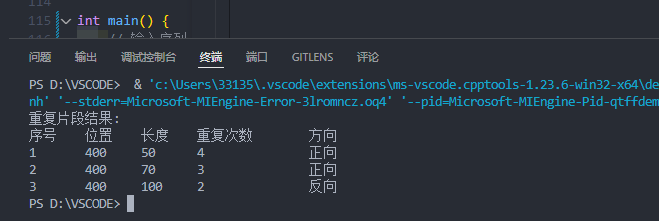

# DNA序列比对算法伪代码

## 1. 数据结构

重复片段结构体
```
结构体 RepeatInfo:
    整数 startPos    // 重复片段起始位置
    整数 endPos      // 重复片段结束位置
    字符串 segment   // 重复片段内容
    整数 repeatCount // 重复次数
```

## 2. 函数

### 计算序列的反向互补序列

```
//返回序列的反向互补序列
函数 getCompSeq(序列)：
    创建碱基对应表 pairMap = {'A':'T', 'T':'A', 'C':'G', 'G':'C'}
    结果序列 = 空字符串
    从后向前遍历序列:
        结果序列 += pairMap[当前碱基]
    返回 结果序列
```
### 动态规划计算两个序列的最长公共子串

```
//使用动态规划计算两个序列的最长公共子串
// 返回二维数组表示每个位置的最长公共子串长度
函数 calcCommon(序列1, 序列2):
    n = 序列1长度
    m = 序列2长度
    创建二维数组 lenTable[n+1][m+1] 初始化为0
    从i=n-1到0:
        从j=m-1到0:
            如果 序列1[i] == 序列2[j]:
                lenTable[i][j] = lenTable[i+1][j+1] + 1
    返回 lenTable
```
### 动态规划计算序列内部的最长公共子串

```
//动态规划：计算序列内部的最长公共子串
//返回二维数组表示每个位置的最长公共子串长度
函数 calcSelf(序列, 最大长度):
    n = 序列长度
    创建二维数组 lenTable[n+1][n+1] 初始化为0
    从i=n-1到0:
        endPos = min(i + 最大长度, n-1)
        从j=endPos到i+1:
            如果 序列[i] == 序列[j]:
                lenTable[i][j] = lenTable[i+1][j+1] + 1
    返回 lenTable
```
### 查找重复片段，返回重复片段结构体的结果集

```
// 3. 查找重复片段
函数 findRepeats(序列, 最大长度, 正向表, 反向表):
    结果集 = 空向量
    pos = 0
    while pos < 序列长度:
        找出当前位置最大匹配长度 maxMatchLen
        bestLen = 0
        found = false
        从len=1到maxMatchLen:
            unit = 序列[pos:pos+len]
            count = 1
            while unit可继续匹配:
                count++
            如果 count >= 2:
                如果 count*len > bestLen:
                    更新最佳匹配信息
                    found = true
        如果 found:
            将最佳匹配添加到结果集
            pos = 最佳匹配结束位置
        否则:
            pos++
    返回 结果集
```
## 3.完整函数

```
//输入参考序列和查询序列
	DNA_Repeat_Detection(参考序列，查询序列)
//1. 计算参考序列的反向互补序列
	参考序列反向互补序列 = getCompSeq(序列)
//2. 计算正向匹配表和反向匹配表
	正向匹配表 = calcCommon(查询序列，参考序列)
	逆向匹配表 = calcCommon(查询序列，参考序列反向互补序列)
//3. 查找重复片段
	结果集 = findRepeats(查询序列，参考序列长度，正向匹配表，逆向匹配表)
//4. 筛选并输出结果:
    对于 每个候选重复片段 repeat 在 repeats 中:
    	如果 当前重复的结束位置repeat.endPos 超过已处理区域 (queryIndex + 当前参考匹配长度):
        	# 计算有效重复次数
        	tempEnd = repeat.endPos
        	stopPos = 当前查询位置 + 参考匹配长度
        	repeatCount = 0
        	# 逆向计算完整重复次数
        	当 tempEnd > stopPos 且 tempEnd > 重复起始位置:
            	repeatCount += 1
            	tempEnd -= 重复单元长度
        	# 确定参考序列匹配位置
        	searchRange = 参考序列长度 - 重复单元长度
        	matchPos = -1
        	matchType = ""
        	# 扫描参考序列寻找匹配
        	对于 i 从 0 到 searchRange:
            	如果 正向匹配表[重复起始位置][i] >= 单元长度:
                	matchType = "正向"
                	matchPos = i + 单元长度  # 转换为末端位置
                	终止循环
            	否则如果 反向匹配表[重复起始位置][i] >= 单元长度:
                	matchType = "反向"
                	matchPos = 参考序列长度 - i  # 反向互补坐标转换
                	终止循环
        	# 输出行
        	如果 matchPos 有效:
            	输出 序号, matchPos, 单元长度, repeatCount, matchType
            	# 更新扫描指针
            	如果 存在有效跳转 (stopPos > 重复起始位置):
                	refIndex += (tempEnd - 当前查询位置)
            	queryIndex = repeat.endPos  
```


## 4. 复杂度分析

参考序列长度为n，查询序列长度为m

1. 计算参考序列的反向互补序列

  时间复杂度：$O(n)$遍历参考序列一次

  空间复杂度：$O(n)$ 存储互补序列

2. 计算正向匹配表和反向匹配表

	时间复杂度：$O(n×m)$  双重循环遍历两个序列

	空间复杂度：$O(n×m)  $存储DP表

3. 查找重复片段

	时间复杂度：O($m^2+2m×k)$， k为最大匹配长度

	空间复杂度：$O(m^2)$  存储自匹配表和结果集

4. 筛选并输出结果:

* 时间复杂度：$O(m)$
* 空间复杂度：$O(1)$


总时间复杂度：$O(m^2)$

总空间复杂度：$O(m^2)$


## 5.运行截图

