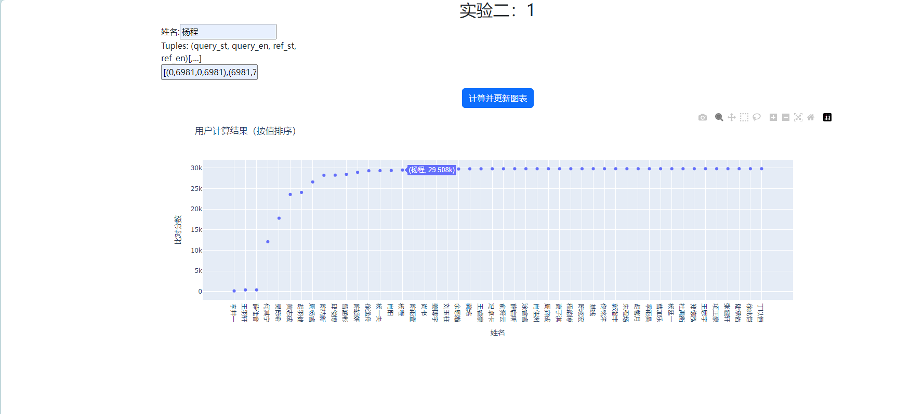
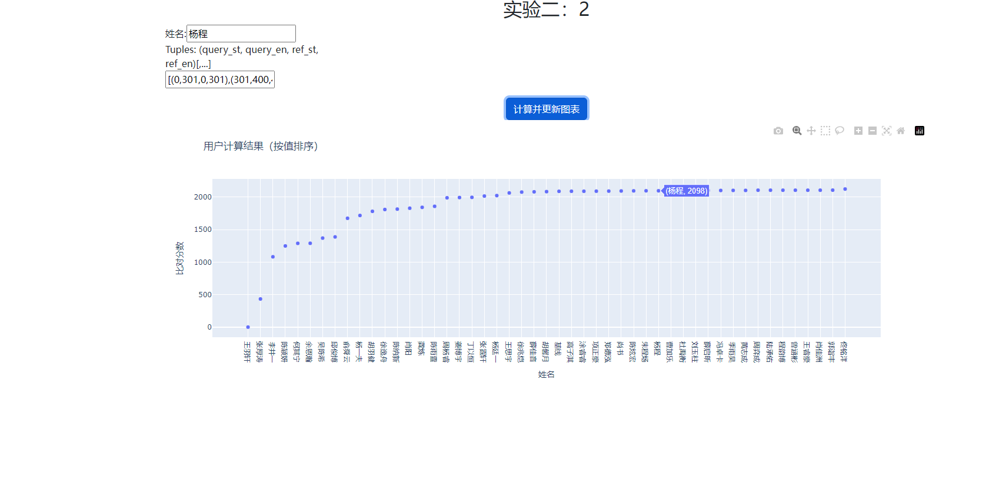

# Lab2复杂DNA序列的比对
- [Lab2复杂DNA序列的比对](#lab2复杂dna序列的比对)
  - [算法](#算法)
    - [一、构建点阵图](#一构建点阵图)
    - [二、对角线匹配](#二对角线匹配)
    - [三、合并间隙小的匹配段](#三合并间隙小的匹配段)
    - [四、填充空白区域，扩展段长度](#四填充空白区域扩展段长度)
    - [五、筛选满足条件的段](#五筛选满足条件的段)
  - [分析](#分析)
  - [运行结果](#运行结果)

## 算法
目标：找到两个序列中匹配或高度相似的片段。

**通过点阵图方法寻找查询序列和参考序列之间的最佳匹配段，合并小间隙的匹配段，使用贪心算法选择最少段覆盖序列区间，填充相邻段间空白区域，最后筛选出满足最小长度和最低错误率的段**

### 一、构建点阵图

假设查询序列长度为M,参考序列长度为N。

创建一个M×N矩阵`grid`，查询序列在位置x与参考序列在位置y的碱基有三种情况：

- **相同，标记为1**
- **互补，标记为2**
- **其他，标记为0**

```c++
build_dotplot(string query, string reference):
    for x in query :
        for y in reference :
            if query[x] == reference[y]:
                grid[x][y] = 1  // 相同碱基
            else if query[x] 和 reference[y] 互补:
                grid[x][y] = 2  // 互补碱基
            else:
                grid[x][y] = 0  // 不匹配
    return grid
```

时间复杂度和空间复杂度均为$O(M×N)$

<div style="page-break-after: always;"></div>

### 二、对角线匹配

在点阵图中，对角线上的连续点表示两个序列的匹配区域。

- **主对角线：相同**序列的匹配
- **反对角线：互补**序列的匹配


遍历点阵图中的主对角线和反对角线，提取连续的匹配段`segment`

匹配段定义为结构体，属性包括：在查询序列的起始坐标、在参考序列的起始坐标、长度、主对角线/反对角线、不匹配的位点数

$(x0,y0,length,direction,distance)$

```c++
// 提取对角线上的连续匹配段
find_diagonal_segments(grid):
    segments = []
    // 处理主对角线
    for d from -M+1 to N-1:
        for each 连续段(start, end):
            if length = end - start > 0:
                add segment {x0, y0, length, direction=1, distance=0} to segments
    // 处理反对角线
    for each anti-diagonal:
        翻转点阵图得到flipped
        for each 连续段(start, end):
            if length = end - start > 0:
                add segment {x0, y0, length, direction=0, distance=0} to segments
    return segments
```

时间复杂度：$O(M×N)$，遍历所有对角线点。

空间复杂度：$O(M + N)$，存储对角线数据和段列表。​


<div style="page-break-after: always;"></div>

### 三、合并间隙小的匹配段

为减少碎片化的匹配段，将同一对角线上间隙较小的段合并。

合并时需确保段在同一对角线（主对角线：`y0 - x0` 相同；反对角线：`x0 + y0` 相同）。

```c++
merge_with_tolerance(segments, max_gap, max_error_rate):
    if segments == NULL: return []
    按方向和对角线编号分组 segments
    初始化结果列表 merged
    对于每个分组：
        按 x0 升序排序组内段
        设置当前段 curr 为第一个段
        对于组内每个段 s:
            计算间隙 gap 和合并长度 merged_len
            if gap <= max_gap 且错误率 <= max_error_rate 且对齐：
                更新 curr 的长度和错误数
            else:
                添加 curr 到 merged
                curr = s
        添加最后一个 curr 到 merged
    返回 merged
```

复杂度分析：

- 时间复杂度：$O(\frac{n}{log n})$，其中 n 为段数量，来自排序。
- 空间复杂度：$O(n) $，存储分组和结果。

### 四、填充空白区域，扩展段长度

为提高覆盖率，在相邻段之间的空白区域寻找新的匹配段，并尝试向前和向后扩展现有段，确保错误率低于阈值。扩展时利用主对角线和反对角线匹配表计算错误数。

<div style="page-break-after: always;"></div>

```c++
// 在相邻段之间的空白区域寻找新匹配段
fill_in_blanks_global(segments, error_rate, min_gap):
    if segments = NULL:
        return []
    按 x0 升序排序 segments
    initial result = []
    for 每对相邻段 (prev, curr):
        add prev 到 result
        gap = [prev.x0 + prev.length, curr.x0 - 1]
        if gap.length >= min_gap:
            调用 find_large_valid_segments_in_range 在 gap 内寻找新段
            add 新段 到 result
    add 最后一个段 到 result
    result = merge_in_blanks(result, error_rate) // 合并段，控制错误率
    return result
    
// 向前扩展段的起始位置，保持错误率低于阈值
extend_start_backward(segments, error_rate):
    if segments == NULL:
        return []
    按 x0 升序排序 segments
    initial result = []
    prev_end = -1
    for each seg:
        target_start = prev_end + 1
        cand_x0 = target_start // 候选起始坐标
        收缩 cand_x0 直到 error_rate 满足 或 无法扩展
        add 扩展后的段 或 原段 到 result
        prev_end = result.last.x0 + result.last.length - 1
    return result
     
// 向后扩展段的结束位置，保持错误率低于阈值
extend_end_backward(segments, error_rate):
    if segments == NULL:
        return []
    按 x0 降序排序 segments
    initial result = []
    prev_end = 第一个段的结束位置
    for each seg:
        target_end = prev_end - 1
        cand_x1 = target_end // 候选结束坐标
        cand_x1 直到 error_rate 满足 或 无法扩展
        add 扩展后的段 到 result
        prev_end = seg.x0
    按 x0 升序排序 result
    return result
```

复杂度分析：

- 填充空白：$O(MN)$，遍历空白区域点。
- 扩展段：$O(\frac{n}{log n} + k)$，其中  k 为扩展点数。
- 空间复杂度： $O(n) $存储段列表。

<div style="page-break-after: always;"></div>

### 五、筛选满足条件的段

筛选长度≥25的段，并选择最少段覆盖整个区间（错误率≤0.08，长度阈值≥20）。最终输出长度≥30的段，并计算得分（有效匹配率>0.9的段累加有效长度）。

```c++
// 选择满足最小长度的段
chose_segs(segments, min_len):
    result = []
    for each segment seg:
        if seg.length >= min_len:
            add seg to result
    return result

// 使用最少段覆盖整个区间，满足错误率和长度要求
minimal_interval_cover2(segments, error_rate, length_thresh):
    if segments == NULL:
        return []
    find segments 的 min_x , max_x
    initial best_end 和 best_idx 数组
    for each seg:
        if seg 的结束位置 > best_end[seg.x0]:
            best_end[seg.x0] = seg 的结束位置
            best_idx[seg.x0] = seg 的索引
    initial result = []
    covered_end = min_x - 1
    while covered_end < max_x:
        寻找覆盖 covered_end + 1 的最佳段
        if 找到 且 新段长度 >= length_thresh 且 错误率 < error_rate:
            add 新段 到 result
            covered_end = 新段的结束位置
        else:
            break
    return result

// 输出结果
get_answer(segments):
    print "Remain segments:"
    for each segment seg:
        if seg.length >= 30:
            print coordinates based on direction // 主对角线或反对角线格式
    print newline

```

复杂度分析：

- 筛选：$O(n)$，遍历段。
- 最小覆盖：$O(\frac{n}{log n})$，排序和选择。
- 输出：$ O(n) $，打印段信息。

<div style="page-break-after: always;"></div>


## 分析

时间复杂度：$O(MN)$

空间复杂度：$O(MN)$


运行第二组序列时较快，但是第一组的空间开销过大，程序崩溃。

这是因为空间复杂度较大，主要在点阵图和对角线匹配矩阵的构建，可以动态计算而不存储，此外可以尽早过滤短段，优化存储。移除flipped矩阵，直接处理对角线。

时间复杂度：$O(MN)$
空间复杂度：$O(M+N)$

最终优化后，程序可以处理第一组序列，运行时间在3分钟以内。


## 运行结果
**第一组**

选择参数：
```c++
    auto final_segs = find_diagonal_segments_np(M, N, 5);
    final_segs = merge_with_tolerance_np(final_segs, 3, 0.08, M, N);
    final_segs = minimal_interval_cover2_np(final_segs, 0.085, 30, M, N);
    final_segs = fill_in_blanks_global_np(final_segs, 0.075, 15, M, N);
    final_segs = chose_segs_np(final_segs, 30);
    final_segs = extend_start_backward_np(final_segs, 0.085, M, N);
    final_segs = extend_end_backward_np(final_segs, 0.085, M, N);
```
输出：
```
(0,6981,0,6981),(6981,7227,6982,7228),(7227,7276,7229,7278),(7277,7352,7275,7350),(7352,7413,22416,22477),(7413,7448,7411,7446),(7448,7524,7445,7521),(7524,7612,7523,7611),(7612,7684,22145,22217),(7684,7885,7677,7878),(7885,7924,7878,7917),(7928,7982,7921,7975),(7993,8088,7986,8081),(8098,8166,8091,8159),(8166,8481,21348,21663),(8481,8513,15007,15039),(8513,8567,21262,21316),(8567,8605,15387,15425),(8605,11014,18815,21224),(11014,11067,15370,15423),(11067,12105,17724,18762),(12105,12135,20756,20786),(12135,12175,17654,17694),(12175,12207,14838,14870),(12207,12807,17021,17621),(12807,12843,15242,15278),(12843,12936,16892,16985),(12936,12975,15370,15409),(12975,14706,15122,16853),(14706,14741,21232,21267),(14741,14789,15039,15087),(14789,14821,21316,21348),(14821,14958,14870,15007),(14958,14991,17621,17654),(14991,16409,13419,14837),(16409,16521,2148,2260),(16521,16809,2260,2548),(16809,16865,12963,13019),(16865,17208,2604,2947),(17208,17274,2943,3009),(17274,17376,12452,12554),(17376,17626,3109,3359),(17626,17784,25660,25818),(17784,17893,25818,25927),(17893,17984,25927,26018),(17984,18089,26017,26122),(18089,18145,26122,26178),(18145,18432,26178,26465),(18432,21673,8155,11396),(21673,21840,21667,21834),(21853,21949,21847,21943),(21949,22152,21943,22146),(22152,22223,7605,7676),(22223,22270,22223,22270),(22270,22311,7517,7558),(22311,22386,22309,22384),(22386,22417,22385,22416),(22429,22549,22428,22548),(22550,22601,22553,22604),(22601,22827,22603,22829),(22827,29829,22828,29830)
```


评分截图：




**第二组**
选择参数

```c++
    auto final_segs = find_diagonal_segments_np(grid); 
    final_segs = merge_with_tolerance_np(final_segs, 1, 0.039); 
    final_segs = minimal_interval_cover2_np(final_segs, 0.08, 20); 
    final_segs = fill_in_blanks_global_np(final_segs, 0.065, 25); 
    final_segs = chose_segs_np(final_segs, 25); 
    final_segs = extend_start_backward_np(final_segs, 0.1); 
    final_segs = extend_end_backward_np(temp, 0.1); 
```
输出：
```
(0,301,0,301),(301,400,401,500),(400,503,497,600),(503,751,603,851),(751,827,751,827),(827,904,727,804),(904,1003,697,796),(1003,1200,703,900),(1200,1303,897,1000),(1303,1404,903,1004),(1404,1501,404,501),(1501,1618,1001,1118),(1618,1651,1318,1351),(1651,1693,1351,1393),(1693,1736,1193,1236),(1736,1802,1236,1302),(1802,1900,1102,1200),(1900,2009,1400,1509),(2285,2500,1485,1700)
```

